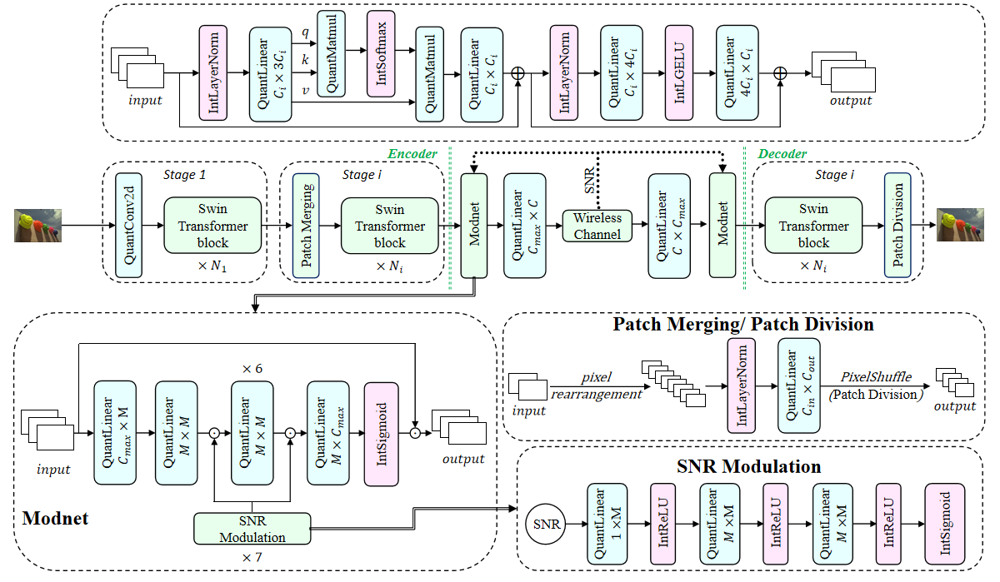

# FQ-LISCS: Fully Quantized Lightweight Image Semantic Communication System for Edge Devices


## Introduction
Our work proposes an innovative solution that, for the first time, systematically applies full-integer quantization and approximation techniques to Transformer-based semantic communication models. This approach enables end-to-end pure-integer inference across the encoder, channel modeling, and decoder, while effectively handling nonlinear modules within the communication framework. By incorporating task-specific optimization strategies, our method significantly reduces inference costs without compromising the quality of image reconstruction.



>  Structure of the FQ-LISCS Model. The quantization operations and integer approximations are labeled with the prefixes "Quant" and "Int" respectively.


## Train

* cbr = C/(2^(2i)*3*2), i denotes the downsample number. For CIFAR10, i=2; for DIV2K/kodak, i=4.
```
python train.py --training --trainset {CIFAR10/DIV2K} --testset {CIFAR10/kodak} -- distortion-metric {MSE/MS-SSIM} --channel-type {awgn/rayleigh} --C {bottleneck dimension} --multiple-snr {random or fixed snr}
```

*e.g. cbr = 0.0625, snr = [1, 4, 7, 10, 13], metric = PSNR, channel = AWGN

```
python train.py --training --trainset DIV2K --testset kodak -- distortion-metric MSE --channel-type awgn --C 96 -- multiple-snr 1,4,7,10,13
```


## Test

```
python train.py --trainset {CIFAR10/DIV2K} --testset {CIFAR10/kodak} -- distortion-metric {MSE/MS-SSIM} --channel-type {awgn/rayleigh} --C {bottleneck dimension} --multiple-snr {random or fixed snr}
```

*e.g. cbr = 0.0625, snr = [1, 4, 7, 10, 13], metric = PSNR, channel = AWGN

```
python train.py --trainset DIV2K --testset kodak --distortion-metric MSE --channel-type awgn --C 96 --multiple-snr 1,4,7,10,13
```

```


# Related links
* BPG image format by _Fabrice Bellard_: https://bellard.org/bpg
* Sionna An Open-Source Library for Next-Generation Physical Layer Research: https://github.com/NVlabs/sionna
* DIV2K image dataset: https://data.vision.ee.ethz.ch/cvl/DIV2K/
* Kodak image dataset: http://r0k.us/graphics/kodak/
